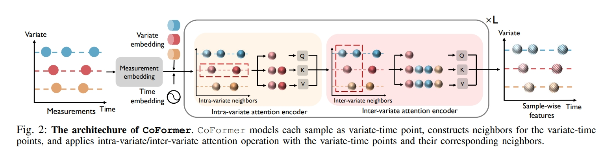

# (ICDM2023) Compatible Transformer for Irregularly Sampled Multivariate Time Series

[Paper](https://arxiv.org/pdf/2310.11022v1.pdf)

# Abstract 
Abstract—To analyze multivariate time series, most previous methods assume regular subsampling of time series, where the interval between adjacent measurements and the number of samples remain unchanged. Practically, data collection systems could produce irregularly sampled time series due to sensor failures and interventions. However, existing methods designed for regularly sampled multivariate time series cannot directly handle irregularity owing to misalignment along both temporal and variate dimensions. To fill this gap, we propose Compatible Transformer (CoFormer), a transformer-based encoder to achieve comprehensive temporal-interaction feature learning for each individual sample in irregular multivariate time series. In CoFormer, we view each sample as a unique variatetime point and leverage intra-variate/inter-variate attentions to learn sample-wise temporal/interaction features based on intravariate/inter-variate neighbors. With CoFormer as the core, we can analyze irregularly sampled multivariate time series for many downstream tasks, including classification and prediction. We conduct extensive experiments on 3 real-world datasets and validate that the proposed CoFormer significantly and consistently outperforms existing methods.

# Usage
You can use the codes under /preprocess folder to preprocess the data. Initial raw data and split index can be downloaded from [Raindrop](https://github.com/mims-harvard/Raindrop/tree/892eb5734e84aa8d18476c6a8975b55b2f30e1d1). You should prepare the PTdict_list.npy or PTdict_list6.npy for preprocess, and the processed data is saved at a specified path, which is also the data root of the dataset. 
You can also download from [preprocessed](https://drive.google.com/drive/folders/1bJ-znPzoOtd54EpnldPqhd0zFTyySUbD?usp=drive_link) to get the preprocessed data and split index. 

Run __train_medical.py__ can both train and test CoFormer. __--split__ parameter specifies the train/test split index, __--data_root__ parameter specifies the data root, where the .npy files are saved, __--dataset__ parameter specifies the dataset type, including p19, p12 and pam.
